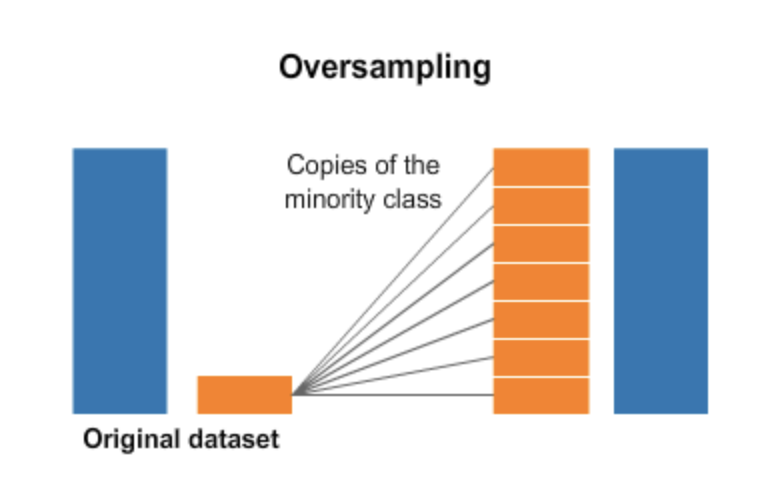

For my very first project in machine learning trying to predict stroke, I've encountered the common problem of handling imbalanced datasets and I wanted to share with you some thoughts about it. 

### What is an imbalanced dataset?

Often found in classification problems, imbalanced datasets are datasets that contain a high majority of one class for the target. They are quite common in areas such as medical diagnosis and fraud detection where data about negative cases (not having the disease or any fraud) are more prevalent than the positive cases. 

To be more concrete, let's say that you have a dataset about patients with a certain illness and you want to predict whether a patient will be diagnosed with this illness or not. In most cases, you will have more data about the part of the population who has not been diagnosed with this illness. 

In my case, I had indeed much more people who have not experienced any stroke than people who have been subject to a cerebrovascular accident. The ratio was more than 95% for the negative class.


### Why is it a problem?

The challenge with imbalanced datasets is that machine learning techniques will often ignore the minority class in the training phase which will lead to incorrect performance. For example, some classifiers like Logistic Regression and Decision Tree will tend to predict only the majority class when the minority class is treated as noise. 

In my case, metrics before any sampling show an accuracy of 96% for logistic regression but we can see that the F1 score for class 1 is equal to 0. 

```
from sklearn.linear_model import LogisticRegression
lr=LogisticRegression(random_state=42)
lr.fit(X_train, y_train)
y_pred_lr=lr.predict(X_test)
print(classification_report(y_test,y_pred_lr))
```


With an imbalanced dataset, the accuracy is not a metric that we can take into account because it is based on the larger part of the target. Based on the large majority of 95% of class 0 (people having not experienced any stroke), the machine learning algorithm could simply classify everything in class 0 and still be correct 95 % of the time. In other words, this model is very accurate predicting when a person is not having a stroke, which is obviously what we don't need...

### What are the solutions?

One of the popular methods is about generating synthetic data with a re sampling technique. 

Synthetic data are data that are created artificially from a computer program rather than being collected.

With a re sampling technique called over-sampling, data are generated based on the data already collected. In the case of an imbalanced dataset, the generative model will be based on the minority class.



[Source](https://www.analyticsvidhya.com/blog/2020/07/10-techniques-to-deal-with-class-imbalance-in-machine-learning/)

In python, [imbalanced-learn](https://imbalanced-learn.org/stable/) is a package that allows this re sampling technique and it is compatible with scikit learn. 

The approach I used was to oversample the minority class with the [SMOTE](https://www.jair.org/index.php/jair/article/view/10302) technique.

```python
from imblearn.over_sampling import SMOTE
sm = SMOTE()
X_oversampled, y_oversampled = sm.fit_resample(X, y)
```

How does it work? 

SMOTE stands for Synthetic Minority Oversampling Technique.

Basically, this method will generate synthetic data through the near-neighbor method. The algorithm will compute the k-nearest neighbors for one given point so that it can generate all the necessary points for the minority class to reach the same level as the majority class. 


[Source](https://www.analyticsvidhya.com/blog/2020/07/10-techniques-to-deal-with-class-imbalance-in-machine-learning/)

This is the result of the dataset after resampling.


This method allowed me to do a proper training and generate a correct score. 


Even though it was only an exercise and I have only used libraries and packages on a small-scale dataset, it was interesting for me to have touched on the tipping point of this technique and see how powerful machine learning algorithms can be.

This experience was also an opportunity for me to think again about this possibility of generating this kind of 'fake' data.


### What are the limitations of synthetic data?

Synthetic data demonstrates its usefulness when there is an intrinsic limitation of the dataset such in the cases of imbalanced dataset or when the data do not exist or are not available. The world of data science became quite excited about this opportunity.

Even though amazing, being able to generate data with a few lines of code made me pause and think about the limitations and the real-world implications. 

As these synthetic data derived from a primary data source, the first limitation that comes to my mind is related to the data source from which the synthetic data is created. What if this source is biased? What about the biases of the scientist?

These are general questions about bias in data but they appear to have even more impact if these biases are reproducing themselves in the newly generated dataset.

Another question I have is about the quality of the synthetic data itself. To me, synthetic data can only mimic the real world, they are not the real world. 

We can think about outliers for example. In the real world, data is pretty noisy - and this is what actually can differentiate fraudulent data from real-world data when looking for data manipulations in research papers ... Can these synthetic data reflect this noise? 

In a [2016 study](https://ieeexplore.ieee.org/document/7796926), MIT researchers were able to create a system that can automatically generate [synthetic data that gave the same results as real data](https://news.mit.edu/2017/artificial-data-give-same-results-as-real-data-0303) statistically speaking. In other words, they were able to inject some noise into the generated data. 

If it is so, I am still wondering about the unexpected. Some of the great innovations come from observing an unexpected phenomenon and I wonder whether these synthetic data would be able to model the unpredictable...

Ultimately, I think that being able to manufacture data was an incredible advancement for machine learning but it seems that, as a lot of new groundbreaking technologies, there is a need to be cautious and use them ethically.  

I am very new in the field and these are some preliminary thoughts I have had when working on my very first data science projects. I would be happy to learn more, so if you have any comments, please let me know. 

You can find the full version of my [Jupyter notebook for the stroke prediction project](https://github.com/tuyenshares/predicting_stroke) in my data analytics repository [here](https://tuyenshares.github.io/).