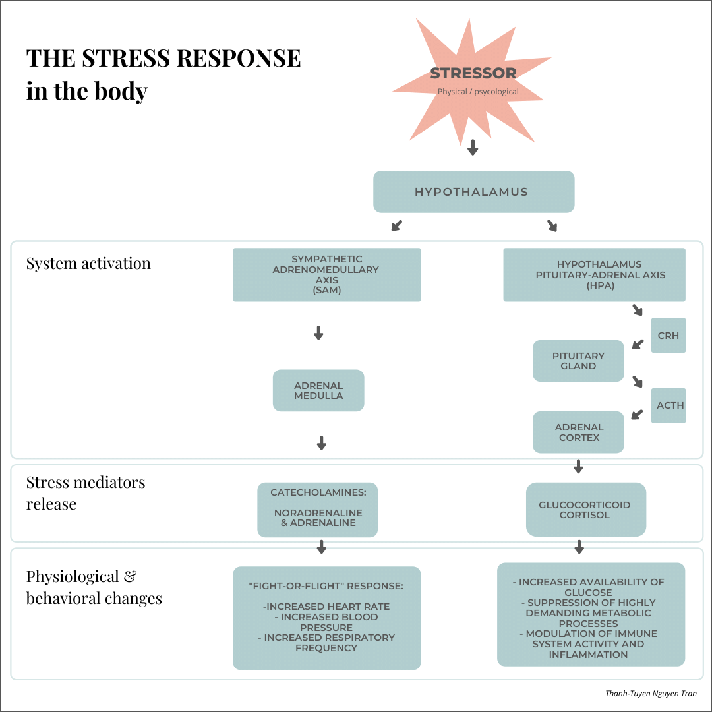

We all have a sense of what stress feels like, especially during this special time where everything has been completely  

We have all heard about the multitude of adverse effects that have been associated with stress (insomnia, hypertension, anxiety and depression to name a few). There is indeed an extensive amount of research that reports the link between stress and negative health outcomes (O’Connor, 2020).  

Countless articles are trying to suggest ways for reducing stress, such as physical activity, relaxation... 

One possible way that is subject to an increasing interest in research concerns the practice of mindfulness. This is one of the fields that passionate me and I wanted to share with you a revised version of a preliminary work I did for my MSc studies, exploring the evidence of the effects of mindfulness on biological stress markers and especially on programme in particular, the Mindfulness-Based stress reduction (MBSR) programme.  

But first, let’s start at looking at what is stress and the biological mechanism of stress in the body.     

### What is stress?

Stress is a multifaceted concept that is hard to grasp in one definition and scholars are still attempting to precise the concept today.   

Though, we all know what stress is referring to. And a definition that I like relates quite well what stress is about. It states that stress occurs when the perceived demand exceeds one’s perceived resources and capability (Lazarus, 1966).  

This idea of overload is essential to keep in mind when it comes to understanding the mechanism of stress and its effect in the body.  

The notion of perception is also important to note as it is a suggested way for coping which will be further detailed later on. 

The biological reaction which occurs in the body following a perceived stress is called the stress response. When an event (actual or potential) is recognised as stressful, a flow of hormones and molecules is released in the body, which triggers a physiological, behavioural, cognitive and emotional response, in order to prepare ourselves to adapt to the situation.  

There is not always a correlation between the objective measures of the stress response at a biological level and the subjective measures of stress. Therefore, a person can report a high level of subjective stress while displaying a low level of biological markers.  

### Stress isn’t always bad

At this point, it is important to note that stress is a natural survival mechanism. It is what kept our ancestors alive, protecting them against predators and other threats.  

Today, the mechanism of stress is still helping us to accomplish tasks more efficiently and reach our goals. Thus, a medium to high level of stress has been associated with increased memory task performance (Sandi, 2013).  

Only chronic and long-term stress is detrimental to our physical and mental health. Experiencing a prolonged period of stress will weaken our system overtime as it is maintained in a situation which is supposed to be exceptional and is continuing to receive the chemicals that are supposed to be released over a short period only to adapt the body to the exceptional changes of the environement, as it will be described just below.  

### The biological model of stress

In its simplest form, stress initiates the need to maintain *homeostasis* whereby the body can regulate itself. It is done through activation of the autonomic nervous system (ANS) and the release of hormones. 

When you experience stress, two systems are activated in the body:  the sympathetic-adrenal-medullary (SAM) and the hypothalamic-pituitary-adrenal (HPA) axis. The first one has an instantaneous effect and does not last while the second takes more time but has a much longer effect on the physiological level.  

When a threatening stimulus is perceived as an acute stressor, the amygdala is activated and sends a signal to the hypothalamus, which in turn, activates the SAM and triggers the release of noradrenaline. The adrenal medulla will also release adrenaline. These catecholamines will lead to an increased heart rate, blood pressure, and respiratory frequency. This rapid response has been called the “fight-or-flight" response, a term coined by Cannon who observed that in presence of a stressful situation, the bodily functions are either intensified or completely suppress in order to prepare for an attack or an escape (Cannon, 1915).  

The other system involved the activation of the HPA axis and the release of corticotrophin release factor (CRF) by the hypothalamus, which is transported to the pituitary gland where it stimulates the release of adrenocorticotrophic hormone (ACTH) which then stimulates the adrenal cortex and the production of glucocorticoid cortisol, known as the ‘stress hormone’.  

It has been suggested that these systems depend also on the categories of stressors involved: physical stressors tend to activate the SAM axis first in order to provide a rapid and almost instantaneous physiological adaptation (the HPA axis will only amplify the mechanism if the stressor is confirmed). As for psychological stressors, as the cognitive processes are involved, they are mainly associated with the HPA axis (Smeets, 2012). 

The release of these catecholamines and glucocorticoids have a beneficial as well as a damaging effect on the body. They are essential to the adapt to the environment and in a limited quantity, they can also improve our metabolism. In the long run, they are exhausting for the body.  

Thus, McEwen proposed the concepts of *allostasis* and *allostatic overload* to explain when the stress response is overused and leads to pathologies (McEwen, 1998).    

### Mindfulness has been suggested to have an effect on stress

It has been suggested that by regulating the body’s response to stress, the practice of mindfulness plays a role in stress management (Creswell, 2017).    

Mindfulness is an umbrella term that covers diverse approaches and schools of practice. The nuances and the evolution of this construct in Western and scientific setting make it quite difficult to retain one single definition. 

Nevertheless, it usually refers to two components:  

self-regulation of attention to the internal and external experiences maintained in the present moment and,   

an attitude including non-judgment, curiosity, openness, and acceptance (Kabat-Zinn, 1995; Bishop, 2004).    

We can notice these two pillars in the commonly cited definition by Jon Kabat Zinn, the father of the Mindfulness-based stress reduction programme (MBSR) who defines mindfulness as ‘paying attention in a particular way: on purpose, in the present moment, and non judgmentally.’ 

This article will be focusing on this specific mindfulness programme, the MBSR programme which is considered as the first secular mindfulness programme used in clinical and general population.  

### Mindfulness-based stress reduction (MBSR) and biological markers of stress

Initially developed for chronic-pain management (Kabat-Zinn, 1982), mindfulness-based stress reduction program (MBSR) is a secular and standardised 8-weeks program consisting of weekly group meetings of around 2.5 hours, with a silent retreat day between week 6 and 7 of the course. The program is composed of theoretical material, experiential learning as well as home practices. The practices taught are guided meditations (body sensations, breath, open-awareness…) as well as mindful movements and mindful eating.    

MBSR has been suggested to be effective with stress, depression, anxiety, and improving the quality of life (Khoury, 2010).  

However, a large part of studies rely exclusively on self-reports and self-rating questionnaires, which in addition to difficulties of assessing mindfulness and the scales themselves (Bergomi, 2013), face some challenges due to their subjectivity and bias (Van Dam, 2018). Therefore, more objective measures and studies using biological markers must be considered.   

This overview will be divided into parts, each of them addressing a different category of biological markers of stress: 

\- Part 1 will be focusing on cortisol, the so-called “stress hormone”. 

\- Part 2 will look at cardiovascular responses. 

\- Part 3 will explore the cellular markers for immune functions as well as the exciting advancement of research on aging. 

\- Last but not least, as stress involves the nervous system, part 4 will discuss neuroimaging studies investigating the neurological effects of MBSR. 

As each part involves a lot of information, I will be covering each of them in separated articles. 

\---

References

O'Connor, D. B., Thayer, J. F., & Vedhara, K. (2020). Stress and health: A review of psychobiological processes. Annual review of psychology, 72.  

Sandi C. (2013). Stress and cognition. Wiley interdisciplinary reviews. Cognitive science, 4(3), 245–261.  

Selye, H. (1951). The general-adaptation-syndrome. Annual review of medicine, 2(1), 327-342.  

McEwen, B. S. (1998). Stress, adaptation, and disease: Allostasis and allostatic load. Annals of the New York academy of sciences, 840(1), 33-44.  

McEwen, B. S. (2006). Protective and damaging effects of stress mediators: central role of the brain. Dialogues in clinical neuroscience, 8(4), 367.  

Miller, J. J., Fletcher, K., & Kabat-Zinn, J. (1995). Three-year follow-up and clinical implications of a mindfulness meditation-based stress reduction intervention in the treatment of anxiety disorders. General hospital psychiatry, 17(3), 192-200.  

Kabat-Zinn, J. (1982). An outpatient program in behavioral medicine for chronic pain patients based on the practice of mindfulness meditation: Theoretical considerations and preliminary results. General hospital psychiatry, 4(1), 33-47. 

Bishop, S. R., Lau, M., Shapiro, S., et al. (2004). Mindfulness: A proposed operational definition. Clinical psychology: Science and practice, 11(3), 230-241.  

Khoury, B., Sharma, M., Rush, S. E., & Fournier, C. (2015). Mindfulness-based stress reduction for healthy individuals: A meta-analysis. Journal of psychosomatic research, 78(6), 519-528.  

Creswell, J. D. (2017). Mindfulness interventions. Annual review of psychology, 68, 491-516.  

Bergomi, C., Tschacher, W., & Kupper, Z. (2013). The assessment of mindfulness with self-report measures: Existing scales and open issues. Mindfulness, 4(3), 191-202.  

Van Dam, N. T., Van Vugt, M. K., Vago, D. R., Schmalzl, et al. (2018). Mind the hype: A critical evaluation and prescriptive agenda for research on mindfulness and meditation. Perspectives on psychological science, 13(1), 36-61.  

Carmody, J., & Baer, R. A. (2008). Relationships between mindfulness practice and levels of mindfulness, medical and psychological symptoms and well-being in a mindfulness-based stress reduction program. Journal of behavioral medicine, 31(1), 23–33.  

Khoury, B., Sharma, M., Rush, S. E., & Fournier, C. (2015). Mindfulness-based stress reduction for healthy individuals: A meta-analysis. Journal of psychosomatic research, 78(6), 519-528.  

Sharma, M., & Rush, S. E. (2014). Mindfulness-based stress reduction as a stress management intervention for healthy individuals: a systematic review. Journal of evidence-based complementary & alternative medicine, 19(4), 271-286.  

Reive, C. (2019). The biological measurements of mindfulness-based stress reduction: a systematic review. Explore, 15(4), 295-307.